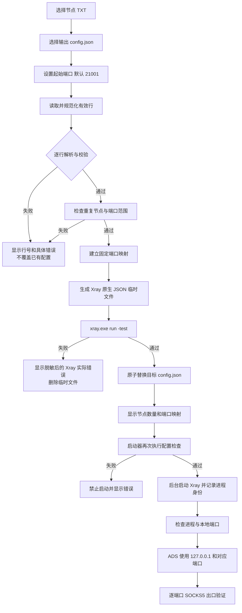
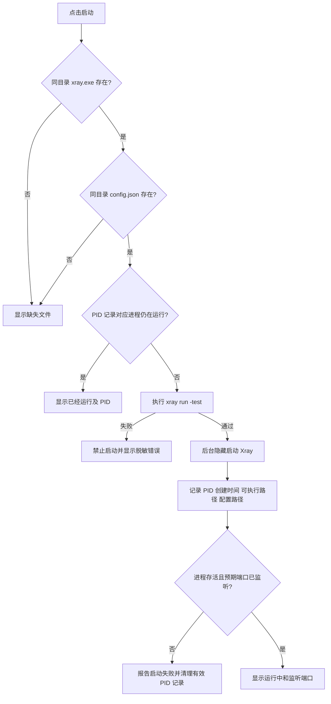
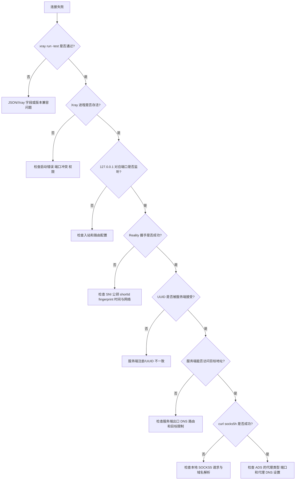

# Xray-core 本地 Reality 转换器工作流程

## 1. 目的与范围

本文档定义从开发、转换、配置验证、Xray 启停到 SOCKS5 联调和故障定位的完整工作流程，作为后续实现和验收的执行基线。

本项目交付两个互相独立的 Windows 便携式程序：

1. `reality-converter.exe`：读取 VLESS 链接 TXT，生成并验证 Xray 原生 `config.json`。
2. `xray-launcher.exe`：完成配置检查、启动、停止和状态查看，只管理本工具启动的 Xray 进程。

建议采用 Go 编译为 Windows EXE，并使用 Windows 原生 GUI。发布包不依赖 Python、PowerShell 或额外 .NET Runtime。

## 2. 不可突破的安全边界

转换器和启动器在所有流程中必须满足：

- SOCKS5 入站固定监听 `127.0.0.1`，禁止 `0.0.0.0`、`::` 和局域网地址。
- 不创建 TUN、透明代理、系统代理或防火墙转发规则。
- 不读取或修改 V2Ray、Clash、sing-box 以及其他 Xray 实例的配置。
- 一个本地入站只绑定一个 Reality 出站，不使用负载均衡、随机选择或自动故障转移。
- 只将用户输入 TXT 中通过校验的节点写入配置。
- 未命中固定路由的流量必须进入 `blackhole`，不得默认直连。
- 停止操作只允许终止由启动器记录且身份校验一致的进程。
- UI、应用日志和错误摘要不得显示完整 UUID、Reality 公钥或完整 VLESS 链接。

## 3. 总体工作流



任何校验失败都必须终止当前操作，不生成部分配置，不启动 Xray，也不覆盖上一次已验证成功的配置。

## 4. 转换器用户流程

### 4.1 打开程序

主窗口提供以下控件：

- 输入 TXT 路径和“选择”按钮。
- 输出 JSON 路径和“选择”按钮。
- 起始 SOCKS5 端口输入框，默认值为 `21001`。
- “转换并检查”按钮。
- 只读结果区域，用于显示成功数量、端口映射和脱敏错误。

未选择有效输入、输出路径或端口时，“转换并检查”不得进入生成阶段。

### 4.2 选择文件并转换

用户操作顺序：

1. 选择包含 VLESS 链接的 TXT。
2. 选择目标 `config.json`。默认建议保存到 `xray.exe` 所在目录。
3. 确认或修改起始端口。
4. 点击“转换并检查”。
5. 等待解析、生成和 Xray 配置检查完成。
6. 成功后查看节点数量和固定端口映射。

转换器执行配置检查时，只查找目标 JSON 同目录下的 `xray.exe`。如果不存在，应明确提示路径，不继续写入正式配置。

## 5. 输入处理流程

### 5.1 文本读取

1. 以 UTF-8 读取 TXT，并兼容 UTF-8 BOM。
2. 保留原始物理行号，用于报告错误。
3. 去掉每行首尾空白。
4. 忽略空行。
5. 忽略第一个非空白字符起以 `#` 或 `//` 开头的注释行。
6. 其余每一行都作为一条完整链接进入同一个解析函数。

单节点和批量节点不得使用不同分支。有效行列表长度为 1 时，也必须生成 1 个入站、1 个 Reality 出站、1 条固定路由和 1 个 `blackhole` 出站。

有效行数量为 0 时，返回“未找到可转换节点”，并停止处理。

### 5.2 URI 解析

每条链接使用标准 URI 解析器处理，不使用字符串切割模拟 URL 解析。处理结果包括：

- Scheme：必须为 `vless`，大小写按 URI 规则规范化后比较。
- User info：提取 UUID。
- Host：支持域名、IPv4，以及带方括号的 IPv6。
- Port：提取远程服务端端口。
- Query：URL 解码后读取参数及别名。
- Fragment：URL 解码后作为节点名称，仅用于显示，不影响 Xray 路由。

查询参数别名统一为内部字段：

| 输入字段 | 内部字段 | Xray 输出字段 |
| --- | --- | --- |
| `type` 或 `network` | network | `streamSettings.network` |
| `pbk` 或 `publicKey` | publicKey | `realitySettings.publicKey` |
| `fp` 或 `fingerprint` | fingerprint | `realitySettings.fingerprint` |
| `sni` 或 `serverName` | serverName | `realitySettings.serverName` |
| `sid` 或 `shortId` | shortId | `realitySettings.shortId` |
| `spx` | spiderX | `realitySettings.spiderX` |

同一语义的两个别名同时出现且值不一致时，按输入冲突报错，不猜测采用哪一个值。

### 5.3 逐行校验

每条链接至少完成以下校验：

| 项目 | 规则 | 错误示例 |
| --- | --- | --- |
| 协议 | 必须为 `vless` | 第 3 行：协议不是 VLESS |
| 网络 | 必须为 `tcp` | 第 4 行：仅支持 TCP，收到 `ws` |
| 安全层 | `security` 必须为 `reality` | 第 5 行：不是 Reality 节点 |
| UUID | 必须存在并能解析为有效 UUID | 第 6 行：UUID 格式无效 |
| 服务器 | 必须是有效域名、IPv4 或 IPv6 | 第 7 行：服务器地址为空 |
| 远程端口 | 必须为 `1..65535` | 第 8 行：服务端端口超出范围 |
| encryption | 必须存在且为 `none` | 第 9 行：VLESS encryption 必须为 none |
| publicKey | 必须存在，并满足 Reality/X25519 编码基本校验 | 第 10 行：Reality 公钥无效 |
| SNI | 必须存在且格式有效 | 第 11 行：缺少 SNI/serverName |
| shortId | 必须存在，为偶数长度十六进制且不超过 16 个字符 | 第 12 行：short ID 格式无效 |
| fingerprint | 必须存在且为安全的非空标识 | 第 13 行：缺少 fingerprint |
| spiderX | URL 解码后保留；未提供时使用 Xray 兼容默认值 | 第 14 行：spiderX 解码失败 |
| flow | 原样保留；是否被当前 Xray 版本接受由 `xray -test` 最终判断 | 第 15 行：Xray 不支持该 flow |

fingerprint 和 flow 不使用容易过期的硬编码白名单；转换器做格式校验，当前 `xray.exe` 做兼容性终检。

### 5.4 重复与端口校验

完成全部逐行校验后：

1. 按规范化后的 `server + serverPort + UUID + publicKey + serverName + shortId` 判断重复节点。
2. 发现重复时报告当前行号和首次出现行号，错误文本只显示节点名称或脱敏标识。
3. 计算最后端口：`startPort + nodeCount - 1`。
4. 起始端口或最后端口不在 `1..65535` 时停止。
5. 为每个节点生成端口后，再对端口集合执行唯一性断言。

当前 UI 只允许设置一个起始端口，端口按 1 递增，因此正常输入不会产生重复端口。仍保留生成后的重复检查，防止后续支持自定义映射时产生无效配置。

## 6. 配置生成流程

### 6.1 固定映射

按有效节点在 TXT 中的出现顺序分配编号，不排序、不随机化：

| 节点序号 | 入站 tag | 本地地址 | 出站 tag |
| --- | --- | --- | --- |
| 1 | `ads-01` | `127.0.0.1:startPort` | `reality-01` |
| 2 | `ads-02` | `127.0.0.1:startPort+1` | `reality-02` |
| N | `ads-NN` | `127.0.0.1:startPort+N-1` | `reality-NN` |

编号至少两位；节点超过 99 个时继续使用完整十进制编号，确保 tag 唯一。

### 6.2 Xray 原生对象

每个 SOCKS5 入站使用 Xray 字段：

- `tag`: `ads-NN`
- `listen`: `127.0.0.1`
- `port`: 分配的本地端口
- `protocol`: `socks`
- `settings.auth`: `noauth`
- `settings.udp`: `true`

每个 Reality 出站使用：

- `protocol`: `vless`
- `tag`: `reality-NN`
- `settings.vnext[].address`: 服务端地址
- `settings.vnext[].port`: 服务端端口
- `settings.vnext[].users[].id`: UUID
- `settings.vnext[].users[].encryption`: `none`
- `settings.vnext[].users[].flow`: 原始 flow；没有 flow 时省略该字段
- `streamSettings.network`: `tcp`
- `streamSettings.security`: `reality`
- `streamSettings.realitySettings`: `serverName`、`fingerprint`、`publicKey`、`shortId`、`spiderX`

不得输出 sing-box 的 `tls.reality.public_key`、`server_port`、`listen_port` 等非 Xray 配置字段。

### 6.3 路由与默认阻断

路由规则按以下顺序生成：

1. 每个 `ads-NN` 精确路由到 `reality-NN`。
2. 最后一条 catch-all 规则将其余 TCP/UDP 流量路由到 `block`。
3. `blackhole` 出站放在 outbounds 首位，作为 Xray 未匹配流量的默认兜底。

这样同时通过显式末尾规则和默认出站顺序保证未匹配流量不会直连。

配置不得添加 `freedom` 出站、balancer、observatory、TUN、dokodemo-door、透明代理或系统代理相关内容。

### 6.4 安全写入

1. 在目标 JSON 同目录创建唯一临时文件。
2. 使用结构化 JSON 序列化器输出缩进 JSON。
3. 重新反序列化临时文件，确认文件完整且结构可读。
4. 对临时文件运行 Xray 配置检查。
5. 检查通过后，原子替换目标 `config.json`。
6. 检查失败时删除临时文件，并保留原有目标配置不变。

## 7. Xray 配置检查流程

执行命令的等价参数为：

```text
xray.exe run -test -config <临时配置绝对路径>
```

执行要求：

- 直接启动进程，不经 PowerShell 或 CMD 拼接命令。
- `xray.exe` 和配置均使用绝对路径。
- 捕获退出码、标准输出和标准错误。
- 设置合理超时；超时后只终止本次检查进程。
- 退出码为 0 才算通过。
- 将已知 UUID、公钥和原始链接从输出中替换为脱敏文本后再显示。
- 保留 Xray 错误类型、字段位置和上下文，不能只显示“转换失败”。

## 8. 启动器流程

### 8.1 启动



启动器启动 Xray 时：

- 不弹出命令行窗口。
- 工作目录固定为启动器目录。
- 参数等价于 `xray.exe run -config config.json`。
- PID 文件由启动器独占管理，并记录进程创建时间、规范化后的 `xray.exe` 路径和配置路径。
- 启动成功需同时满足：进程未提前退出，以及配置中的所有 `127.0.0.1` SOCKS5 端口在超时内进入监听状态。
- 端口已被其他进程占用时，明确列出冲突端口，但不终止占用进程。

### 8.2 停止

停止流程：

1. 读取 PID 记录。
2. 查询该 PID 是否存在。
3. 比对进程创建时间和可执行文件绝对路径，防止 PID 被复用。
4. 身份不一致时删除过期记录，但不终止该进程。
5. 身份一致时只向该进程发出停止请求。
6. 等待退出；超时后提示用户，不批量结束同名进程。
7. 确认退出后删除 PID 文件并刷新状态。

任何情况下都禁止使用 `taskkill /IM xray.exe` 或按名称枚举后批量终止。

### 8.3 状态

状态窗口显示：

- `运行中`、`已停止`、`记录已过期` 或 `配置无效`。
- 由本启动器管理的 PID。
- `xray.exe` 和 `config.json` 的绝对路径。
- 从配置读取的本地监听端口列表。
- 每个端口当前是否正在监听。

状态检查只读，不启动、不停止进程，也不修改配置。

## 9. 客户运行流程

推荐交付目录：

```text
Reality-Local/
  reality-converter.exe
  xray-launcher.exe
  xray.exe
  config.json
  nodes.example.txt
  使用说明.txt
```

客户首次使用：

1. 将收到的 VLESS + Reality 链接逐行放入 TXT。
2. 打开 `reality-converter.exe`，生成同目录 `config.json`。
3. 确认转换成功数量和端口映射。
4. 打开 `xray-launcher.exe`，点击启动。
5. 确认状态为运行中，所有预期端口已监听。
6. 在 ADS 中选择 SOCKS5，地址填 `127.0.0.1`，端口填对应端口。
7. ADS 必须通过 SOCKS5 代理解析域名，行为等价于 `socks5h`。

节点 TXT 或起始端口变化后，应停止当前实例，重新转换并通过检查，再启动新配置。

## 10. 测试工作流

### 10.1 自动化测试

每次构建必须运行：

1. URI 解析单元测试。
2. 字段别名、URL 解码和 fragment 名称测试。
3. 参数校验和行号错误测试。
4. 重复节点、端口唯一性和端口上限测试。
5. 单节点及批量配置快照/结构测试。
6. 启动器 PID 身份、过期记录和端口状态测试。
7. 使用指定版本 `xray.exe` 对每个成功样例执行 `run -test`。

固定测试矩阵：

| 类别 | 用例 | 预期结果 |
| --- | --- | --- |
| 数量 | 1、5、8、10、12 条 | 生成相同数量的入站、出站和固定路由 |
| 文本 | 空行、缩进、`#`/`//` 注释 | 正确忽略并保留真实行号 |
| 编码 | URL 编码节点名、`spx=%2F` | 节点名解码，`spiderX` 为 `/` |
| 参数 | 多种 fingerprint、地址、端口、UUID、SNI、公钥、shortId | 原值正确映射到 Xray 字段 |
| 重复 | 重复节点、构造重复端口 | 带相关行号/端口拒绝生成 |
| 范围 | 最后端口为 65535、超过 65535 | 前者通过，后者拒绝 |
| 缺失 | 分别缺少各关键参数 | 指出参数名和物理行号 |
| 协议 | 非 VLESS、非 Reality、非 TCP | 分类报错并拒绝生成 |
| 配置 | 生成的每个成功样例 | `xray run -test` 退出码为 0 |

自动化样例使用专用无效测试凭据，不将客户真实 UUID 或公钥提交到源码仓库。

### 10.2 本机启动测试

对每个成功配置：

1. 确保测试端口未被占用。
2. 使用启动器启动 Xray。
3. 验证 Xray 进程身份与 PID 记录一致。
4. 验证配置中的每个端口只监听 `127.0.0.1`。
5. 验证未监听 `0.0.0.0` 或 `[::]`。
6. 使用启动器停止并确认所有本实例端口释放。
7. 确认其他同名 Xray 进程未受影响。

### 10.3 真实节点集成测试

真实出口验证必须使用可用且出口已知的节点：

1. 为每个节点记录预期名称和预期出口 IP；测试报告中不记录凭据。
2. 启动已通过配置检查的 Xray。
3. 逐端口执行：

```powershell
curl.exe --proxy socks5h://127.0.0.1:<端口> https://api.ipify.org
```

4. 确认请求成功，并将实际出口 IP 与该端口的预期节点比对。
5. 每个端口至少测试一次，不能只测试第一个端口。
6. 在 ADS 中用同一端口复测域名解析和页面访问。

配置语法检查不能证明远端节点可用；没有真实节点和服务端状态时，集成测试不得标记为通过。

## 11. 故障诊断流程



诊断证据对应关系：

| 现象或日志 | 初步分类 | 下一步 |
| --- | --- | --- |
| `xray run -test` 报错 | JSON、字段或 Xray 版本问题 | 检查配置生成与 Xray 实际错误 |
| `127.0.0.1:端口` 拒绝连接 | 未启动、进程退出或端口未监听 | 检查进程、端口冲突和入站配置 |
| `TLS handshake failed` / `connection reset` | Reality 握手或网络问题 | 检查 SNI、公钥、shortId、fingerprint、系统时间和链路 |
| `invalid request user id` | UUID 未在服务端注册或不一致 | 核对服务端用户配置 |
| `received request` / `XtlsFilterTls found tls` / `tunneling request` | Reality 和服务端转发阶段已成功 | 继续检查目标站、服务端出口和本地客户端 |
| `curl socks5h` 成功但 ADS 失败 | ADS 配置问题 | 检查 SOCKS5 类型、端口和代理 DNS |

不得仅凭“网站打不开”判断转换器错误。必须保留配置检查、进程状态、端口监听、握手、服务端用户、服务端出口和 ADS 设置七层结论。

## 12. 开发与交付阶段

| 阶段 | 工作内容 | 完成门槛 |
| --- | --- | --- |
| 1. 工程骨架 | Go 工程、Windows GUI、构建脚本、版本信息 | 可生成无需额外运行时的 EXE |
| 2. 解析与校验 | 单一解析管线、别名、解码、逐行错误、脱敏 | 输入矩阵单元测试通过 |
| 3. 配置生成 | Xray 原生对象、固定映射、blackhole、原子写入 | 1/5/8/10+ 节点结构测试通过 |
| 4. Xray 检查 | 查找同目录 Xray、捕获错误、超时、脱敏 | 所有成功样例通过指定 Xray 版本检查 |
| 5. 转换器 GUI | 文件选择、端口、结果和错误显示 | 无命令行即可完成转换 |
| 6. 启动器 | 启动、停止、状态、PID 身份、端口检查 | 不影响其他 Xray 实例 |
| 7. 本机验收 | 监听范围、启停、端口冲突、失败恢复 | 仅监听 localhost，旧配置不被失败操作覆盖 |
| 8. 真实联调 | 逐端口 curl 与 ADS 测试 | 每个端口匹配预期 Reality 出口 |
| 9. 发布 | EXE、校验值、使用说明、测试报告 | 干净 Windows 环境可直接运行 |

## 13. 最终验收清单

- [ ] 转换器与启动器均为便携式 Windows EXE。
- [ ] 单节点输入生成恰好 1 组映射，不出现 0 节点。
- [ ] 批量输入保持原始有效行顺序。
- [ ] 所有错误包含物理行号或明确的全局字段。
- [ ] `spx=%2F` 输出为 `spiderX: "/"`。
- [ ] JSON 完全符合 Xray 原生结构。
- [ ] 所有入站只监听 `127.0.0.1`。
- [ ] 每个 `ads-NN` 只路由到对应 `reality-NN`。
- [ ] 未匹配流量进入 `block`，配置中没有 `freedom`。
- [ ] 转换失败或 Xray 检查失败不会覆盖旧配置。
- [ ] 日志不包含完整 UUID、公钥或原始 VLESS 链接。
- [ ] 启动器只管理自己记录且身份一致的 PID。
- [ ] 所有成功样例通过 `xray.exe run -test -config`。
- [ ] 每个真实端口完成 `curl --proxy socks5h` 验证。
- [ ] ADS 逐配置确认端口和出口节点对应正确。

